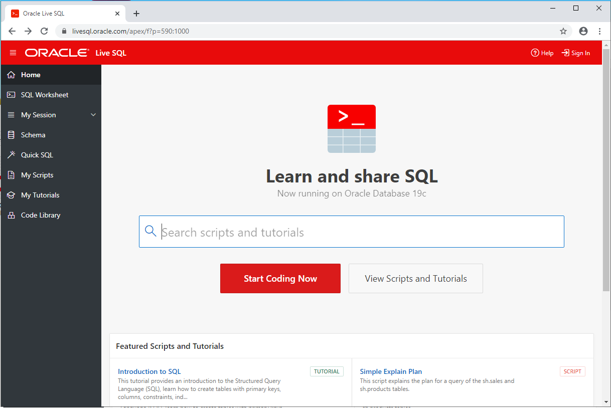
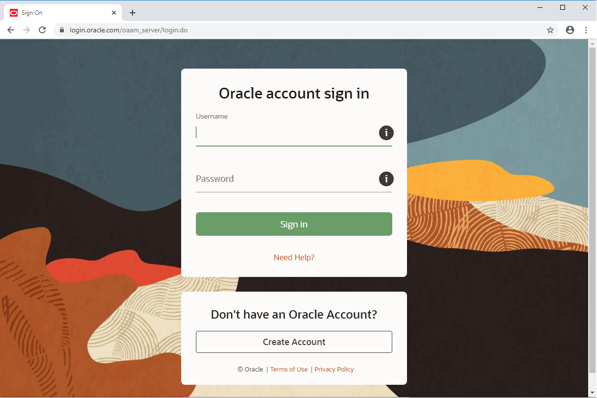
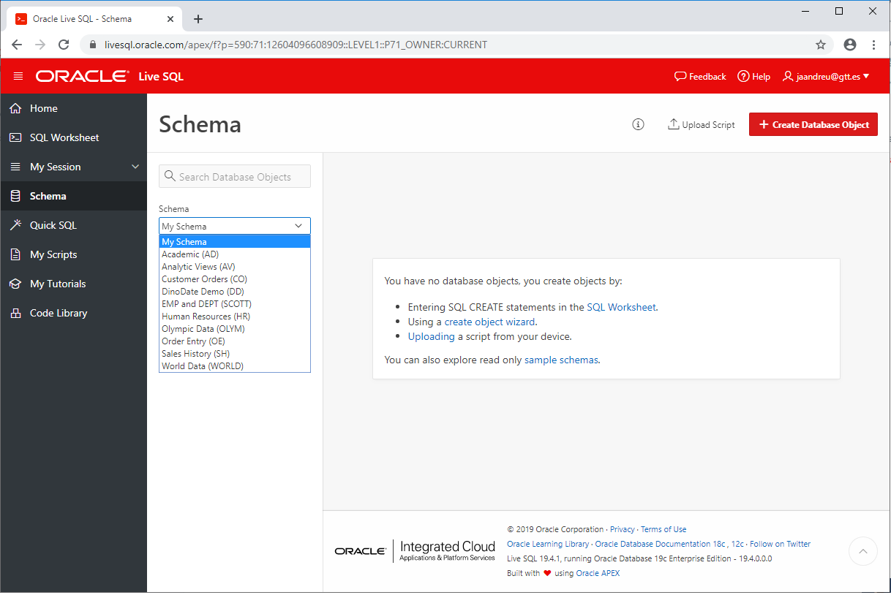

# Configuración del entorno de trabajo

## Oracle Live SQL

Oracle Live SQL es una plataforma que Oracle pone a nuestra disposición de manera gratuita para crear, compartir y probar conceptos de SQL y PL/SQL.

En esta plataforma hay compartidos scripts y tutoriales que podemos consultar y ejecutar sobre una base de datos **Oracle Database 19c**.

## Alta en la plataforma

Para darnos de alta en esta plataforma accederemos a la url [https://livesql.oracle.com](https://livesql.oracle.com/) y haremos login en la misma, es necesario contar con una cuenta de Oracle, si no tenemos una, tendremos que crearla.

A continuación verificaremos nuestro e-mail, aceptaremos las condiciones y estaremos en disposición de utilizar nuestra base de datos.

Esta base de datos viene con unos cuantos esquemas de ejemplo que podemos utilizar para nuestras consultas, además hay un esquema vacío "**My Schema**" donde podremos crear nuestros objetos de base de datos.

